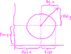
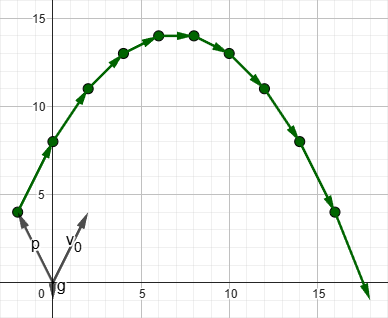
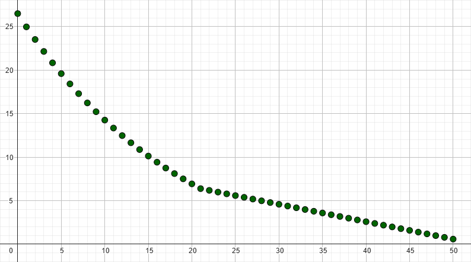
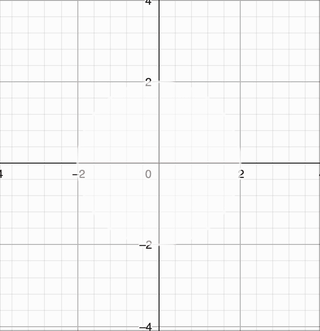
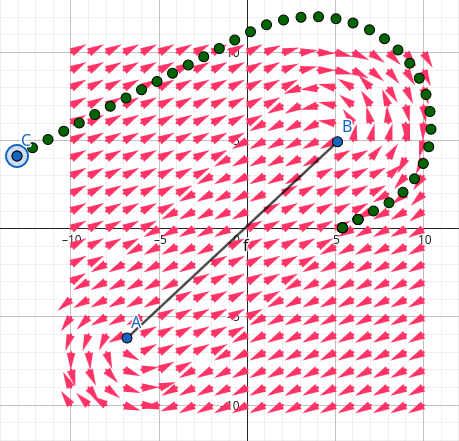

# TP SIMD - 2do Cuatrimestre 2025
## Arquitectura y Organización del Computador

|            | Comisión Furfaro | Comisión David |
| --                       | -- | -- |
| **Presentación** | 25/09/2025 | 29/09/2025 | 
| **Entrega**      | 09/10/2025 | 13/10/2025 | 
| **Reentrega**    | 30/10/2025 | 03/11/2025 | 

-----------

| <video src="https://github.com/user-attachments/assets/c12791de-100e-4673-8b1e-288129b7f776"> | <video src="https://github.com/user-attachments/assets/48c76c35-e521-4940-8cea-3dfd27044a19"> | <video src="https://github.com/user-attachments/assets/d52e7034-c75b-43cc-bc2d-24dbc9445698"> |
| -- | -- | -- |
| <video src="https://github.com/user-attachments/assets/75b1ae20-c4cf-4db2-bbb4-50f640b11e6b"> | <video src="https://github.com/user-attachments/assets/218a9d2e-fe35-41a8-9113-0ed0a4da9486"> | <video src="https://github.com/user-attachments/assets/9a2008bc-8f21-4392-a58d-199058bfaa11">


En este trabajo vamos a implementar un pequeño sistema de partículas.
Utilizaremos los sets de instrucciones SIMD disponibles en procesadores intel (SSE, SSE2, SSE3, AVX, etc).
Aplicaremos lo visto en clase programando de manera vectorizada cada una de las manipulaciones relevantes.

Se espera que los ejercicios se resuelvan haciendo uso del paradigma SIMD, procesando **múltiples datos simultáneamente** siempre que sea posible.

# Compilación y Testeo

Para compilar y ejecutar los tests se dispone de un archivo
`Makefile` con los siguientes *targets*:

| Comando             | Descripción                                                                    |
| ------------------- | ------------------------------------------------------------------------------ |
| `make run`          | Corre el ejecutable principal del ejercicio (framework de debugging).          |
| `make run_c`        | Corre los tests de todos los ejercicios usando la implementación en C.         |
| `make run_asm`      | Corre los tests de todos los ejercicios usando la implementación en ASM.       |
| `make run_grader`   | Evalúa el trabajo práctico (corre los ejercicios 1, 2, 3 con valgrind usando la implementación en ASM).  |
| `make valgrind_c`   | Corre los tests de todos los ejercicios en valgrind usando la implementación en C.  |
| `make valgrind_asm` | Corre los tests de todos los ejercicios en valgrind usando la implementación en ASM. |
| `make main`         | Genera el ejecutable principal del ejercicio.                                  |
| `make test_c`       | Genera el ejecutable de testing usando la implementación en C del ejercicio.   |
| `make test_asm`     | Genera el ejecutable de testing usando la implementación en ASM del ejercicio. |
| `make grader`       | Genera el ejecutable con el que se evaluará el trabajo práctico.               |
| `make clean`        | Borra todo archivo generado por el `Makefile`.                                 |

# A tener en cuenta

- Es importante que lean la documentación provista en los archivos correspondientes
  (`ejercicios.h`, `ejercicios.c` ó `ejercicios.asm` según corresponda).
- Todos los incisos son independientes entre sí.
- El archivo `main.c` y el target correspondiente `make run` permiten correr un framework de debugging frame por frame de los efectos visuales. El archivo SHORTCUTS.md es una cheatsheet de los atajos de teclado disponibles en este framework.
- El sistema de tests de este trabajo práctico **sólo correrá los tests que hayan marcado como hechos**.
  Para esto deben modificar la variable correspondiente (`ej_c.posiciones_hecho`, `ej_asm.tamanios_hecho`, etc) asignándole `true` (en C) ó `TRUE` (en ASM).

# Enunciado

Simular fuego, agua o humo es una tarea compleja y costosa.
La mayoría del software en tiempo real utiliza aproximaciones sencillas "suficientemente buenas"
en lugar de representar la realidad de forma fehaciente.

En este trabajo modelaremos este tipo de efectos construyendo un pequeño _sistema de partículas_.
Como nuestra simulación constará de decenas de miles de partículas se solicita escribir
las manipulaciones de éstas utilizando las extensiones SIMD del procesador.

Para nuestra simulación utilizaremos un modelo discreto donde cada "paso de simulación" representa un lapso fijo de tiempo.

Cada partícula se representa como un punto con las siguientes propiedades:
- Una **posición** constituida por dos floats de 32 bits, uno para cada coordenada $(X, Y)$ (`emitter_t.paricles_pos`)
- Un **color** dado por por cuatro enteros sin signo de 8 bits representando los canales _Red_, _Green_, _Blue_ y _Alpha_ respectivamente (`emitter_t.particles_color`).
- Un **tamaño** representado por un float de 32 bits (`emitter_t.particles_size`).
- Una **velocidad** dada por dos floats de 32 bits, uno para cada coordenada $(X, Y)$ (`emitter_t.particles_vel`)

<p align="center">
  
</p>

## Ejercicio 1

El movimiento básico de nuestras partículas se rige por dos reglas muy sencillas:
1. En todo paso de simulación la posición de una partícula recibe su velocidad actual como incremento.
2. En todo paso de simulación la velocidad de una partícula recibe la fuerza de gravedad como incremento.

Estas reglas se aplican en el orden dado y corresponden con el siguiente par de fórmulas:
```math
\begin{align}
p_{t+1} = p_t + v_t \\
v_{t+1} = v_t + g
\end{align}
```
Los estados iniciales ($p_0$, $v_0$ y $g$) son administrados por el sistema.

Para resolver este ejercicio se debe implementar en SIMD una rutina que
dado un `emitter` y una _fuerza de gravedad_ calcule la siguiente posición y velocidad de cada partícula.

<details>
  <summary>Explicación de la fórmula (Click para expandir)</summary>

  Lo que implementamos acá es una versión discretizada de un tiro oblicuo.
  Pueden jugar con los efectos de la fórmula en https://www.geogebra.org/classic/prgns46z.

  <p align="center">
    
  </p>

  **Parámetros:**
  - `g.x`: La fuerza en el eje $x$ que debemos aplicarle a nuestras partículas en cada paso de simulación.
  - `g.y`: La fuerza en el eje $y$ que debemos aplicarle a nuestras partículas en cada paso de simulación.
</details>


Las _posiciones_, _velocidades_ y la _fuerza de gravedad_ están dadas por la estructura `vec2_t` que representa un vector de dos dimensiones. La definición de `vec2_t` es la siguiente:
```c
typedef struct {
  float x;
  float y;
} vec2_t;
```

La firma de la rutina a implementar el la siguiente:
```
void ej_posiciones(emitter_t* emitter, vec2_t* gravedad);
```

## Ejercicio 2

Hay efectos para los cuales el paso del tiempo hace que las partículas crezcan y otros en los que se achican hasta desaparecer.
Para este ejercicio se solicita implementar una pequeña rutina que varíe el tamaño de las partículas con el paso del tiempo.

La rutina a implementar recibe un `emitter` y los coeficientes `a`, `b`, `c` (todos _floats_).
Por cada partícula del `emitter` debe calcular su nuevo tamaño basándose en el anterior de acuerdo a la siguiente fórmula:
```math
\text{Tamaño}_{t+1} = \begin{cases}
  a \text{Tamaño}_t - b & \text{si } c \leq \text{Tamaño}_t \\
  \text{Tamaño}_t - b   & \text{sino}
\end{cases}
```

<details>
  <summary>Explicación de la fórmula (Click para expandir)</summary>

  Para situaciones donde $a < 1$ las particulas se achican exponencialmente hasta llegar a un punto en el que solo observan una decrecimiento lineal.
  Pueden jugar con los efectos de la fórmula en https://www.geogebra.org/classic/bxkfdhen.

  <p align="center">
    
  </p>

  **Parámetros:**
  - `a`: Caída o crecimiento exponencial del tamaño de la partícula
  - `b`: Caída o crecimiento lineal del tamaño de la partícula
  - `c`: Tamaño a partir del cuál sólo se aplica la caída lineal (en lugar de aplicarse ambas)
</details>

La firma de la rutina a implementar es la siguiente:
```c
void ej_tamanios(emitter_t* emitter, float a, float b, float c);
```

## Ejercicio 3

Finalmente, el color de cada partícula _"se apaga"_ a lo largo de su vida.
Los colores son representados con cuatro números de 8 bits sin signo: $R$, $G$, $B$ y $A$.
Cada uno de esos números marca la intensidad de el canal correspondiente (rojo, verde, azul y opacidad respectivamente), reducirlos oscurece el color y lo vuelve más transparente.

Al igual que con los tamaños el proceso de transformación de los colores será dado por una función $f: \text{Color} \rightarrow \text{Color}$.
Por sencillez se utilizará una caída lineal hasta llegar a un color negro sin opacidad alguna.
La fórmula a implementar es la siguiente:
```math
\begin{align}
R_{t+1} = \text{max}(0, R_t - \Delta_r) \\
G_{t+1} = \text{max}(0, G_t - \Delta_g) \\
B_{t+1} = \text{max}(0, B_t - \Delta_b) \\
A_{t+1} = \text{max}(0, A_t - \Delta_a)
\end{align}
```

<details>
  <summary>Explicación de la fórmula (Click para expandir)</summary>

  Ésta definición de colores los trata como un punto en $\mathbb{R}^4$ y su evolución a lo largo del tiempo traza una recta sencilla.
  Pueden jugar con los efectos de la fórmula en https://www.geogebra.org/classic/keh7acqm.

  <p align="center">
    
  </p>

  **Parámetros:**
  - $\Delta_r$: Un número positivo entre 0 y 255, la disminución que debe tener el canal rojo en cada _step_ de simulación.
  - $\Delta_g$: Un número positivo entre 0 y 255, la disminución que debe tener el canal azul en cada _step_ de simulación.
  - $\Delta_b$: Un número positivo entre 0 y 255, la disminución que debe tener el canal verde en cada _step_ de simulación.
  - $\Delta_a$: Un número positivo entre 0 y 255, la disminución que debe tener la opacidad en cada _step_ de simulación.
</details>

Se solicita entonces implementar una rutina que dado un `emitter` y un conjunto de deltas (todos positivos) aplique la transformación descrita.
La firma de la rutina a implementar es la siguiente:
```c
void ej_colores(emitter_t* emitter, SDL_Color a_restar);
```

> [!CAUTION]
> `SDL_Color` es una estructura dada por la biblioteca gráfica usada por la cátedra.
> Al ser una estructura muy pequeña el ABI la empaqueta dentro de un registro y la pasa como si fuera un número de 32 bits.
> La representación que se elije al ponerla en un registro es tal que al ser guardado en memoria preserve el orden RGBA, esto significa que **al visualizarlo como número hexadecimal el orden que se verá es `0xAABBGGRR`**.

## Ejercicio 4 (Opcional)

Finalmente podemos poner las partículas en un [campo vectorial](https://es.wikipedia.org/wiki/Campo_vectorial) y usar las fuerzas descritas por el mismo para animarlas.
Partiendo de una posición inicial $p_0$ definimos entonces una sucesión $p_t$ donde saber $p_t$ alcanza para calcular $p_{t+1}$.

En cada paso de simulación se calcula $\Delta_t$, el _"empuje"_ que recibe la partícula en el paso $t$.
Podemos pensar que existe una $f(p) = \Delta$.
Desde ese punto de vista la simulación a programar es $p_{t+1} = p_t + f(p_t)$.

La fórmula para calcular $\Delta$ es la siguiente:
```math
\begin{align}
s &= \text{Punto de partida} \\
e &= \text{Punto de llegada} \\
r &= \text{Radio de la órbita} \\
\overline{ps} &= p_t - s \\
\overline{es} &= e - s \\
h &= \text{min}(1, \text{max}(0, \frac{\overline{ps} \overline{es}}{\overline{es}\overline{es}})) \\
q &= \overline{ps} - h \overline{es} \\
\Delta &= \left( \begin{array}{} 0.2588 & -0.9659 \\ 0.9659 & 0.2588 \end{array} \right) \frac{q}{|q|} \\
p_{t+1} &= \begin{cases}
  p_t - \Delta & \text{si } 0 \leq |q| - r \\
  p_t + \Delta & \text{sino}
\end{cases}
\end{align}
```

<details>
  <summary>Explicación de la fórmula (Click para expandir)</summary>

  La fórmula describe órbitas alrededor de un segmento dado por los puntos $s$ y $e$.
  Todos los puntos con distancia menor a $r$ se consideran _"dentro"_ de la figura y todos los puntos con distancia mayor a $r$ fuera.
  Las órbitas _"chocan"_ con el perímetro de la figura y se quedan atrapadas allí.
  Pueden jugar con los efectos de la fórmula en https://www.geogebra.org/classic/p4gguu5h.

  <p align="center">
    
  </p>

  **Parámetros:**
  - `start.x`: La posición en el eje horizontal de uno de los extremos de la figura orbitada
  - `start.y`: La posición en el eje vertical de uno de los extremos de la figura orbitada
  - `end.x`: La posición en el eje horizontal del otro extremo de la figura orbitada
  - `end.y`: La posición en el eje vertical del otro extremo de la figura orbitada
  - `radius`: Tamaño de la figura orbitada
</details>

Se tiene la implementación en C de la misma (disponible en `ejercicios.c`) y se requiere hacer una en lenguaje ensamblador usando los sets de instrucciones SIMD.
La rutina a implementar recibe un `emitter`, los extremos de la forma que se orbita y el radio de la misma.
Debe actualizar las posiciones de todas las partículas controladas por el `emitter`.

La firma de la rutina a implementar es la siguiente:
```c
void ej_orbitar(emitter_t* emitter, vec2_t* start, vec2_t* end, float r);
```

# Mas información

- [Shortcuts de teclado](SHORTCUTS.md)
